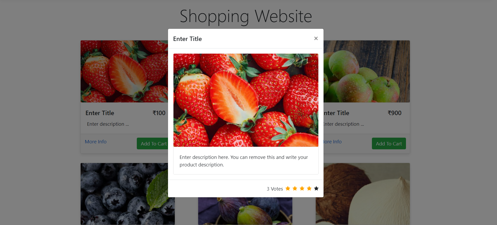
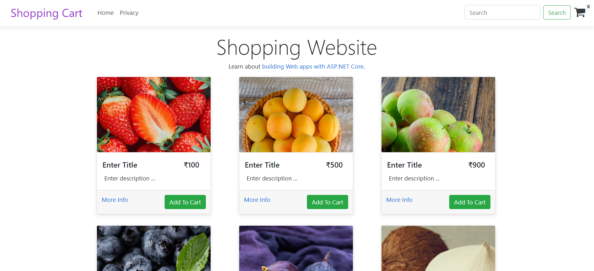

<h1>View the website by clicking the link below:</h1>
<h3><a href="http://Aspnetshoppingcart.somee.com">http://Aspnetshoppingcart.somee.com</a></h3>
 
<h2>Brief Overview</h2>
A Shopping cart template built using Asp.Net Core 3.0 with Razor Pages and Blazor Components. Users can enter their product names, descriptions, and prices. The template allows you to view multiple products, add ratings, add products to your cart, remove products, and view the cart total. 
 
<h2>Technologies Used</h2>
<ul>
  <li>Asp.Net Core 3.0</li>
  <li>IDE- Visual Studio Community 2022</li>
  <li>C# Tools- 4.10.0</li>
  <li>Razor- 17.10.3</li>
  <li>Bootstrap- 4.3.1</li>
  <li>HTML</li>
  <li>CSS</li>
  <li>Website hosted through somee.com</li>
</ul>
 
<h2>Features</h2>
<h3>View and Add ratings to each Product</h3>

<h3>Add Product to Cart</h3>

<h3>Remove Product from Cart</h3>

